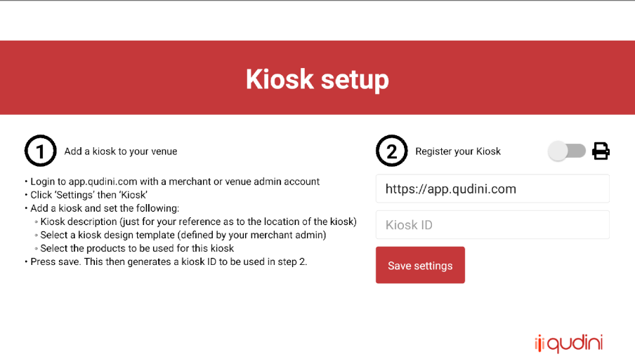

# RN-Qudini-Kiosk

|Android | iOS |
|--------|-----|
|||

## Installation
* `npm install`
* `react-native link`

## Running:
Either  

1. `npm restart`  

2. `react-native run-(android|ios)`

or one of these  
`npm run start:android`  
`npm run start:ios`

## Building for production:

* generate _.keystore_ file (if missing)  
`keytool -genkey -v -keystore rn-rqudini-kiosk.keystore -keyalg RSA -keysize 2048 -validity 10000 -alias rn-qudini-kiosk`
* create __keystore.properties__ file inside of "android" folder and set there store password, store alias and path
* make sure `storeFile` pointing to keystore file and password(s) are correct

### For __Android__:
* `npm run build:android` - this will build source code and generate signed apk.  
Make sure you executed `react-native link` because that command copy assets.
### For __iOS__:
* `npm run build:ios` - this will build source code, copy assets and generate new bundle.  

Or you can build through Xcode. To do this you have to open **rnQudiniKiosk.xcodeproj**, then go to **Product** -> **Scheme** -> select **rnQudiniKioskRelease**. Then you can build project to get Release build.

## Building for Windows

Packing a Windows application on a different platform requires additional configuration and may still not work (since native libraries are required to install an executable file icon), so run the following commands under Windows

1. To build source code for windows app run `npm run web:build` - this will build application source code, copy images and assets and will create `index.html` from template  
    - You can execute `npm run web:watch` to run webpack-dev-server and check application (in `dev` mode) in web-browser

2. Navigate to the build folder (`cd web/build`)  

3. Install dependencies packages `npm install`  

4. And execute `npm run dist` - this will package application in electron  
    - You can run electron app without packing it by executing `npm start` in `web/build` directory

#

